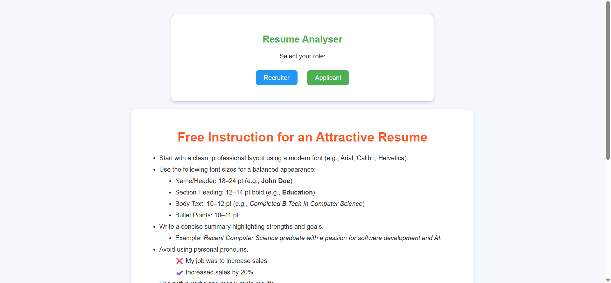
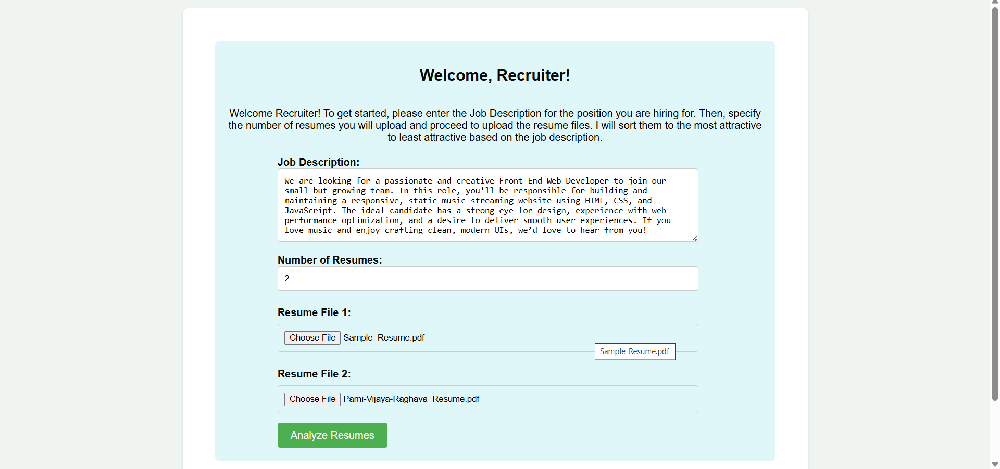
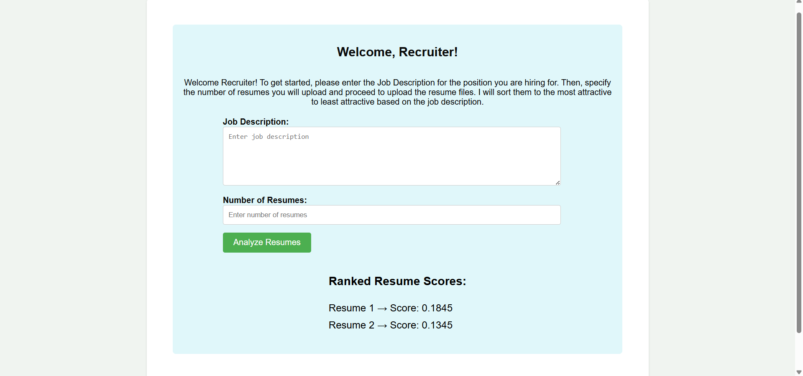
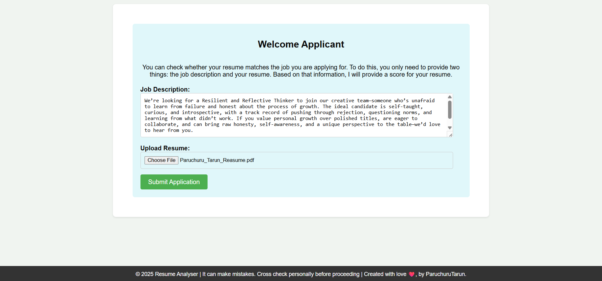
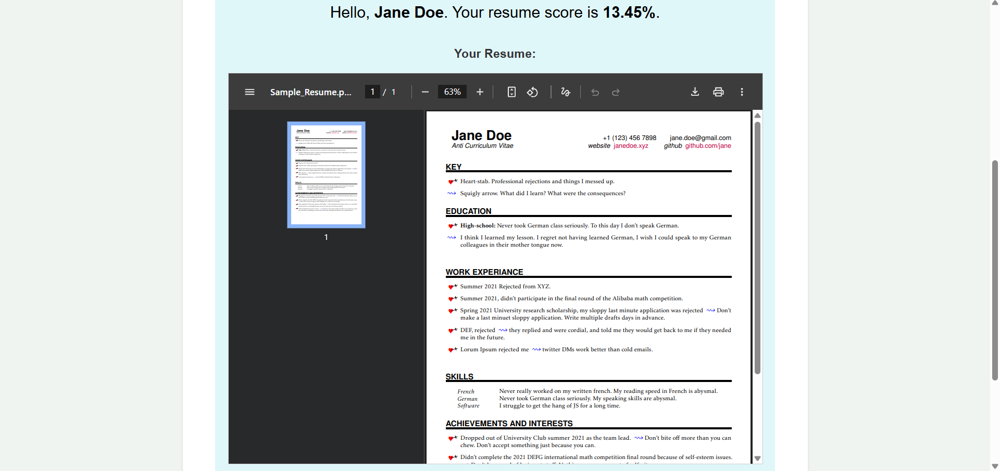

# 🧠 Resume Analyzer

A smart tool that analyzes resumes to extract useful insights, identify skills, highlight gaps, and offer personalized recommendations to improve job readiness. Perfect for job seekers, HR teams, and career coaches.







---

## 🚀 Features

- 📄 Parse resumes (PDF, DOCX, or TXT)
- 🧠 Extract key sections: Education, Experience, Skills, Projects
- ✅ Match resumes against job descriptions
- 📉 Identify gaps in skills or experience
- 💡 Recommend improvements and industry keywords
- 📊 Visual summary (e.g. skill graphs, word clouds)

---

## 🛠 Tech Stack

- Python (NLP, Regex, Data Parsing)
- Flask / Streamlit (Web interface)
- spaCy / NLTK (Text processing)
- Pandas / Matplotlib / Plotly (Data visualization)
- PDFPlumber / python-docx (File handling)

---


## 📦 Setup Instructions

```bash
1. Clone the repository:
git clone https://github.com/yourusername/resume-analyzer.git

2. Create a virtual environment:
python -m venv venv
source venv/bin/activate  # or venv\Scripts\activate on Windows

3. Install dependencies:
pip install -r requirements.txt

4. Run the application:
python app.py
